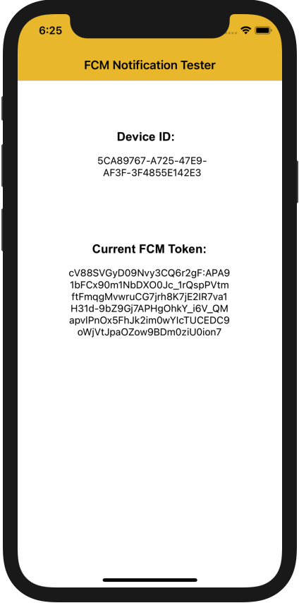

# FCM Notification Tester

This project offers two simple applications to test FCM (Firebase Cloud Messaging) Push Notifications, both for native iOS and native Android. 

These applications were created following the Firebase's documentation and part of this tutorial should be followed again to configure them to use with another Firebase project.

Note: both applications were created as the first projects of both Kotlin and Swift of this repository's author. Their goals are to create a simple tool to test FCM push notifications and to get started with Android and iOS apps structure.

## The apps
Both Android and iOS versions have the same basic structure: one simple view that shows the Firebase token and a device ID and handle the FCM notifications received on the device. The following images show the app on both platforms.

On both platforms the "Device ID" and "Current FCM Token" values are copyable so they can easily be used to register the device on a backend or create test notifications directly on Firebase.

## Setup for Android

To setup the project, there are some steps from the [Android step-by-step](https://firebase.google.com/docs/cloud-messaging/android/client) documentation that must be followed:

- [Register your app with Firebase](https://firebase.google.com/docs/cloud-messaging/android/client#register_your_app_with_firebase)
- [Add a Firebase configuration file](https://firebase.google.com/docs/cloud-messaging/android/client#add_a_firebase_configuration_file)

## Setup for iOS
In the same way, there are some steps from the [iOS step-by-step](https://firebase.google.com/docs/cloud-messaging/ios/client) documentation that must be followed to setup the iOS project:

- Obtain an Apple Push Notification Authentication Key for your Apple Developer account (requires Apple Developer account).
- Enable Push Notifications in Xcode under App > Capabilities (requires Apple Developer account).
- [Register your app with Firebase](https://firebase.google.com/docs/cloud-messaging/ios/client#register-app)
- [Add a Firebase configuration file](https://firebase.google.com/docs/cloud-messaging/ios/client#add-config-file)
- Install the pods (`pod install` inside the project directory)
- [Upload your APNS authentication key](https://firebase.google.com/docs/cloud-messaging/ios/client#upload_your_apns_authentication_key)